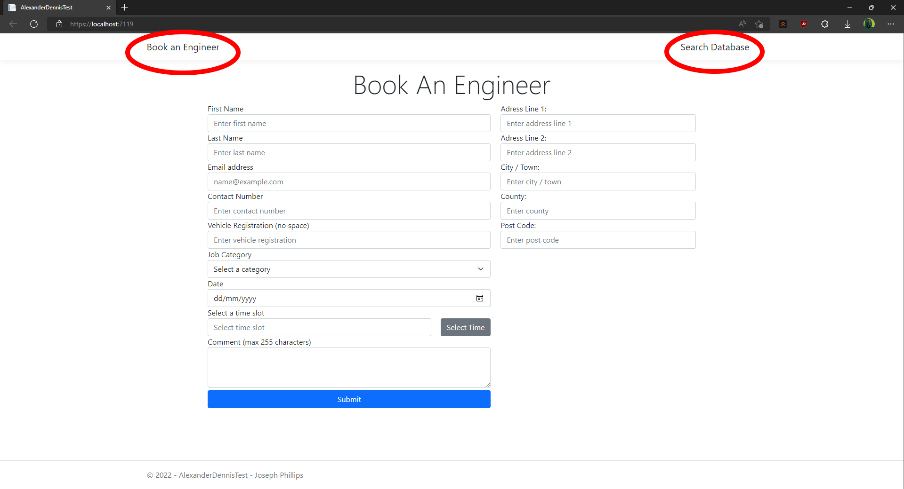

# AlexanderDennisTest

This is my recruitment project for Alexander Dennis.   

I have used Visual Studio 2022 with .NET 6.0.    

NuGet Packages used:
 - FluentEmail
 - Microsoft.Data.SqlClient
 - Newtonsoft.Json
 
This must be configured to connect to a SQL server database. A connection string can be set in appsettings.json.   
For a local host connection on a database called 'AlexanderDennis' I use this string: > Server=localhost\\SQLEXPRESS;Database=AlexanderDennis;TrustServerCertificate=True;Trusted_Connection=True;   
(Note: I used TrustServerCertificate=True;Trusted_Connection=True at the end of my string to prevent SSL errors)    
To create a database I used microsoft sql server management studio (SSMS).
Once the database has been created I have a SQL query in the repo (AlexanderDennisDatabaseInit.sql) to create the two needed tables and insert needed data (EngineerTable and FullyBookedTimesTable).     

Everything in the specification has been completed, including the bonus (apart from pagination on the database table).   

All web api endpoints are available to use with postman and the browser but all have added to the GUI too.
There are two pages:

The frontend is kept simple with provided bootstrap in .NET 6.0. I have avoided jQuery when possible to make it more in line with React / Angular.   

If you have any questions or trouble setting it up please email me.   

